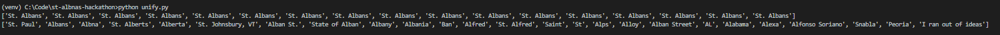

# Tinybird "St. Albnas" Hackathon: Solution

This solution solve the problem with Fuzzy String Matching.

All the positives are converted correctly.

No negatives are converted falsly.

Here are the results:



## Reproduce the Results

Set up your environment and install the packages from `requirements.txt`

```bash
pip install -r requirements.txt
```

Then, run

```bash
python unify.py
```

Pls give me $20 off 👉👈
