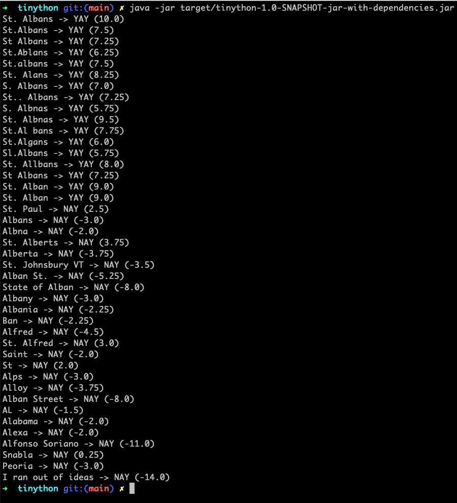

# Tinybird "St. Albnas" Hackathon

## Because someone had to code it on old school Java ;)

The solution is developed on Java 17 and packageable using maven.

```
mvn clean package
```

Will place a tinython-1.0-SNAPSHOT-jar-with-dependencies.jar inside the target folder.

**Anyway you can just open it on, I guess, any modern IDE and just hit run.**

Both positives.txt and negatives.txt files are on the /resources folder so if you package it a simple:

```
java -jar target/tinython-1.0-SNAPSHOT-jar-with-dependencies.jar
```

Should do the job.


